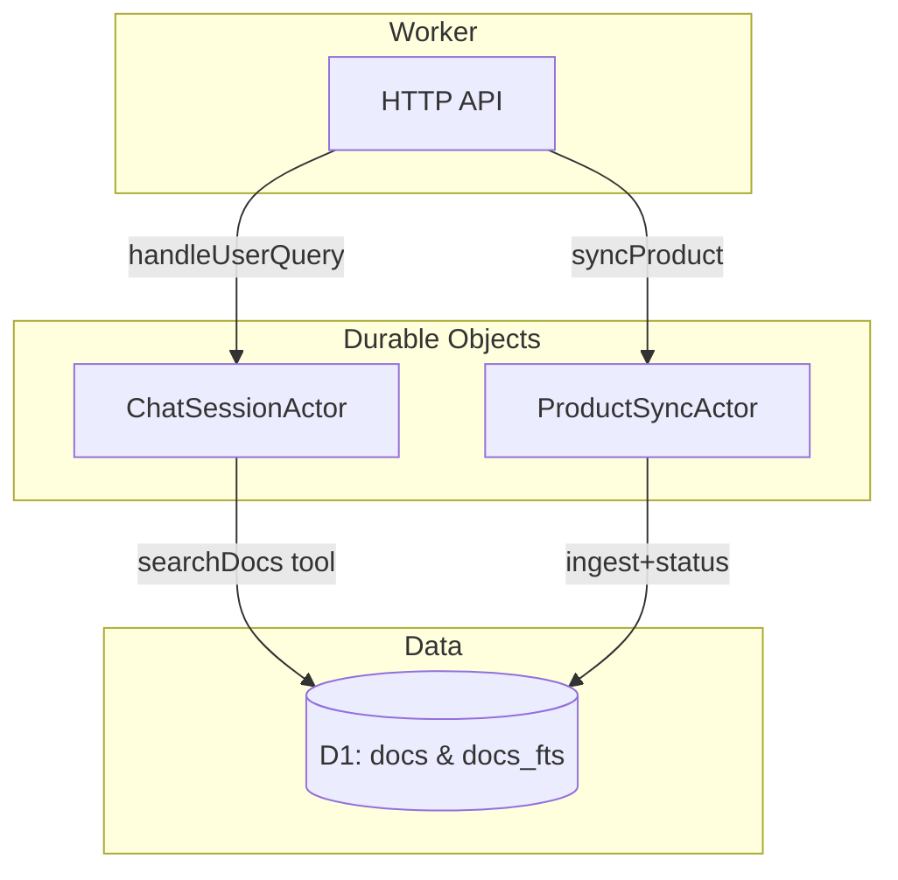

# Cloudflare Docs MCP

Stateful Worker that keeps Cloudflare documentation search in sync while serving
conversational answers. Actors manage long-lived responsibilities and the
Agents SDK orchestrates retrieval augmented responses.

## Architecture



* **ProductSyncActor** – tracks per-product ingestion state and schedules
  recurring syncs via alarms.
* **ChatSessionActor** – persists chat history and invokes the DocsAgent helper
  which performs D1 lookups (and optional LLM calls) through the Agents SDK.

## HTTP API

| Endpoint | Method | Description |
| --- | --- | --- |
| `/api/sync/:product` | `POST` | Start or resume ingestion for the specified product key. Returns the latest status snapshot immediately. |
| `/api/chat/:sessionId` | `POST` | Accepts `{ "query": "..." }`, forwards the turn to the `ChatSessionActor`, and returns `{ reply, citations, historyLength }`. |
| `/healthz` | `GET` | Simple readiness probe. |

Example calls:

```sh
curl -X POST https://<worker>/api/sync/workers
curl -X POST https://<worker>/api/chat/demo-session \
  -H "content-type: application/json" \
  -d '{"query":"How do I bind D1 in Workers?"}'
```

## Environment & bindings

| Binding | Description |
| --- | --- |
| `DB` | D1 database containing `docs` and `docs_fts` tables. |
| `PRODUCT_SYNC_ACTOR` | Durable Object namespace for `ProductSyncActor`. |
| `CHAT_SESSION_ACTOR` | Durable Object namespace for `ChatSessionActor`. |
| `AI` (optional) | Workers AI binding for LLM-backed answers. |
| `DOCS_AGENT_MODEL` / `AI_MODEL` (optional) | Model name used by the DocsAgent helper. |
| `PRODUCT_SYNC_CRON` (optional) | Cron schedule controlling automatic ingestion (defaults to `0 */6 * * *`). |

> **Note:** If a required binding is missing the worker logs a descriptive error
> and returns a 500 to callers.

## Local development

```sh
npm install
npm run dev
```

The development server exposes the same routes as production. Durable Objects
are available when running through `wrangler dev`.

### Database migrations

```sh
# Apply migrations using a local D1 instance
npm run migrate:local

# Apply migrations to the remote production database
npm run migrate:remote
```

### Tests & linting

```sh
npm run check
npm test
```

## Deployment

```sh
npm run deploy
```

The `deploy` script applies remote migrations before publishing the Worker to
avoid schema drift.

## Troubleshooting

| Symptom | Resolution |
| --- | --- |
| `Actor responded with 404` | Ensure the Durable Object bindings in `wrangler.toml` use the same class names as the TypeScript exports. Run `wrangler deploy` to update the bindings. |
| `Query is required` errors | Provide a JSON body with a non-empty `query` field when calling the chat endpoint. |
| Empty chat responses | Verify the D1 database has documents and that the optional AI binding/model names are correctly configured. The system falls back to deterministic summaries when AI is unavailable. |
| Sync stuck in `in_progress` | Check Worker logs for ingestion errors. The state persists between invocations so manual intervention may be required before retrying. |
